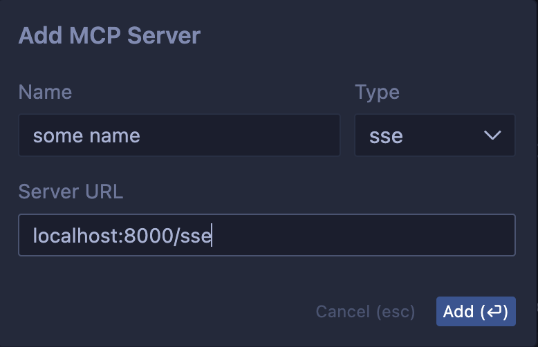
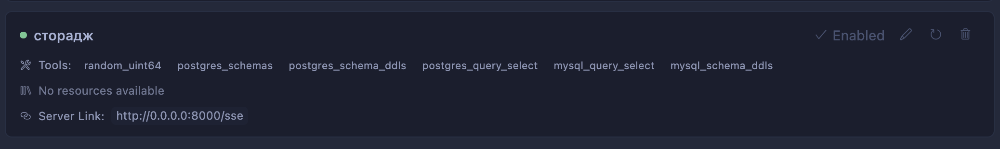

# MCP Server for Storage Query

An MCP-compatible server implementation that provides powerful storage and database connectivity tools.

## Key Features

- **Database Connectivity** - Connect to PostgreSQL and MySQL databases
- **Schema Inspection** - Retrieve database schemas and DDL statements
- **Query Execution** - Run SELECT queries against connected databases
- **Multiple Transport Support** - Server-Sent Events (SSE) for HTTP and Standard I/O (stdio)
- **Cursor Integration** - Seamlessly use database tools in Cursor AI chat

## Available Tools

This implementation includes several built-in tools for database and storage operations:

- **random_uint64**: Generates a random 64-bit unsigned integer (useful for testing)
- **postgres_schemas**: Retrieves PostgreSQL database schema information
- **postgres_schema_ddls**: Gets DDL statements for a specific PostgreSQL schema
- **postgres_query_select**: Executes a SELECT query on a PostgreSQL database
- **mysql_query_select**: Executes a SELECT query on a MySQL database
- **mysql_schema_ddls**: Gets DDL statements for a specific MySQL schema

## Installation

```bash
# Install from the current directory
pip install -e .
```

## Quick Start

### Starting the MCP Server

Start the MCP server using the SSE transport:

```bash
# Using uv
uv run mcp_server --transport sse --port 8000
```

## Using with Cursor

1. Add mcp server


2. Run it via command above (uv run mcp_server --transport sse --port 8000)

3. Done! You should see available list of tools


4. Start a new chat in the AI pane in Cursor. The agent will automatically have access to the available tools. If the agent doesn't use a tool when expected, you can explicitly prompt it to use a specific MCP tool.

## Debugging with cli client

For debugging purposes, you can use the included client to test tools directly:

```bash
# List available tools
uv run client --transport sse --port 8000

# Test the random_uint64 tool
uv run client --transport sse --port 8000 --tool random_uint64

# Test database tools
uv run client --transport sse --port 8000 --tool postgres_schemas
uv run client --transport sse --port 8000 --tool postgres_schema_ddls --args '{"schema_name": "public"}'
```

## Server Options

```
--port INTEGER               Port to run the server on [default: 8000]
--transport [stdio|sse]      Transport type [default: stdio]
--debug                      Enable debug logging
--verbose                    Show detailed logs
--help                       Show this message and exit
```

## What is MCP?

The Model Context Protocol (MCP) is a standardized communication protocol designed for interactions between Large Language Models (LLMs) and external tools/services. It provides a structured way for applications to extend LLM capabilities by connecting to various data sources and services.

MCP uses JSON-RPC 2.0 as its messaging format and supports multiple transport mechanisms:
- **Server-Sent Events (SSE)**: HTTP-based protocol for push notifications
- **Standard I/O (stdio)**: Direct communication through stdin/stdout for local integrations


NOTE:
all code generated with sonnet 3.7, use only as reference for your prototypes, this is not a production ready code!